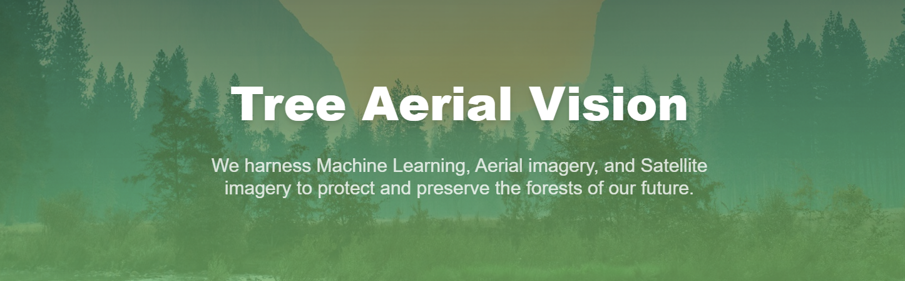
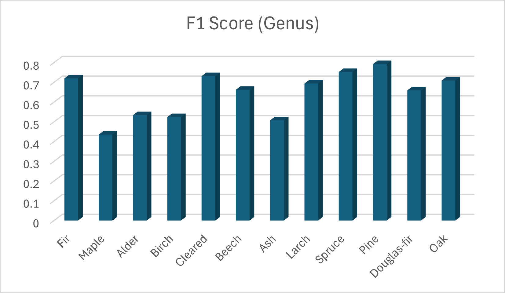
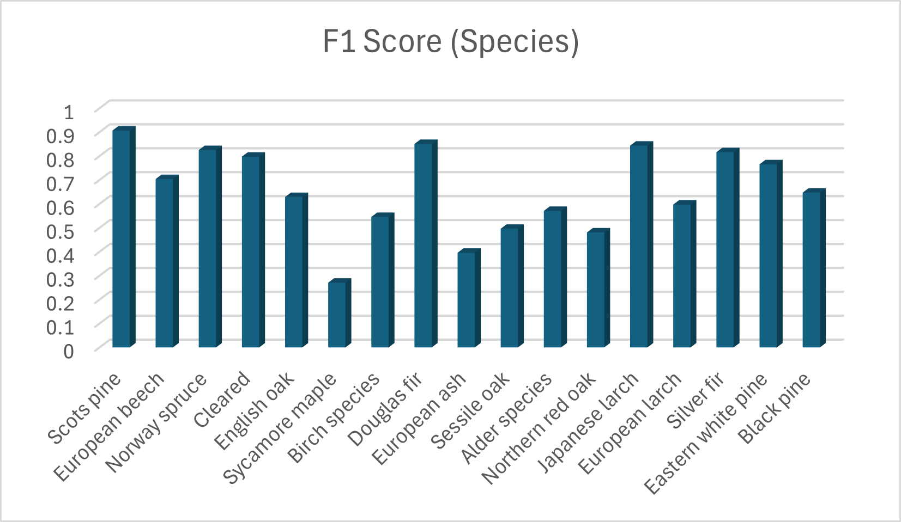
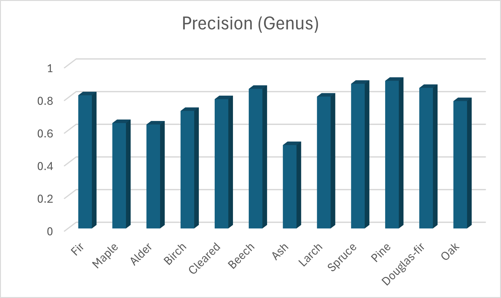
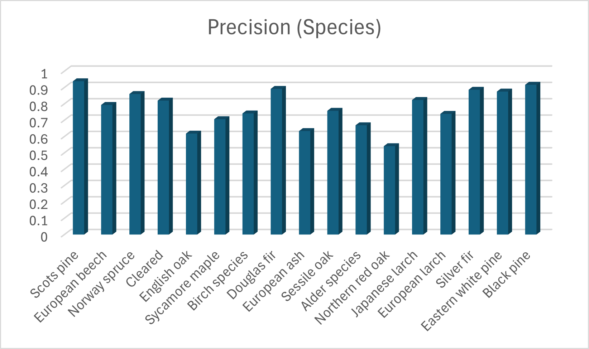

# Tree-ML-Aerial-Vision


## Deployment
Feel free to try the deployed version: [website](https://378a-2604-3d08-4680-1236-5de0-2c17-c8e1-d465.ngrok-free.app/)

## Overview
This project trains a machine learning model to classify trees at the canopy level based on aerial images with 15–20 cm pixel resolution. The model performs classification for both **genus** (12 classes) and **species** (17 classes) categories. It uses a **ResNet-18** backbone architecture and is based on methodologies described in the **TreeSatAI** paper.

The training pipeline in this project is modified from the original approach. Specifically, several minority classes are removed, oversampling is applied to address class imbalance, and IBW is also used during training to further balance the learning process. Additionally, data augmentation techniques such as random brightness and hue-saturation adjustments are introduced to mitigate lighting variations in the input images. 

Other techniques, such as a multiresolution pyramid, were also implemented to improve generalization across varying input resolutions. However, this method was ultimately discarded due to limited improvement in generalizability testing and convergence issues during training.

## Model Performance
The following testing results are obtained from the test set, which represents 10% of the total dataset.

| Metric          | Genus  | Species |
|:----------------|:------:|:-------:|
| Mean F1 Score   | 0.643  | 0.683   |
| Mean Precision  | 76.8%  | 78.0%   |

<div align="center">
  
  
  

  
  
</div>

The images show the per-class performance (F1 Score and Precision) for both the genus and species classification models.

## Classes

| Genus | Species |
|:-----|:--------|
| **Abies** (Fir) | **Pinus_sylvestris** (Scots pine) |
| **Acer** (Maple) | **Fagus_sylvatica** (European beech) |
| **Alnus** (Alder) | **Picea_abies** (Norway spruce) |
| **Betula** (Birch) | **Cleared** (Cleared) |
| **Cleared** (Cleared) | **Quercus_robur** (English oak) |
| **Fagus** (Beech) | **Acer_pseudoplatanus** (Sycamore maple) |
| **Fraxinus** (Ash) | **Betula_spec.** (Birch species) |
| **Larix** (Larch) | **Pseudotsuga_menziesii** (Douglas fir) |
| **Picea** (Spruce) | **Fraxinus_excelsior** (European ash) |
| **Pinus** (Pine) | **Quercus_petraea** (Sessile oak) |
| **Pseudotsuga** (Douglas-fir) | **Alnus_spec.** (Alder species) |
| **Quercus** (Oak) | **Quercus_rubra** (Northern red oak) |
| | **Larix_kaempferi** (Japanese larch) |
| | **Larix_decidua** (European larch) |
| | **Abies_alba** (Silver fir) |
| | **Pinus_strobus** (Eastern white pine) |
| | **Pinus_nigra** (Black pine) |

## How to Run

### 1. Set up Environment Variables
Before running the project, create a `.env` file at the root directory with the following content:

```env
API_KEY=your_google_api_key_here
SERVER_IP=your_server_ip_here (EX: http://127.0.0.1:8000)
VITE_SERVER_IP=same_as_above (EX: http://127.0.0.1:8000)
```

### 2. Start the Frontend
Open a terminal and run:

```bash
cd client
npm install
npm run dev
```
### 3. Start the Backend Server
Open another terminal and run:
```bash
cd server
python server.py
```

## Known Limitations

1. **Imbalanced Dataset** : **Tilia**, **Prunus**, and **Populus** were excluded from training due to their limited number of samples in the dataset.

2. **Fixed Tile Size** : Each tile is fixed at 304×304 pixels, covering approximately 50×50 cm² of ground area. Attempts to reduce the tile size by slicing the training images resulted in a noticeable increase in false positives. This is likely because smaller tiles lose important detail and spatial context, making different tree classes harder to distinguish. Therefore, unless additional training data becomes available, reducing the tile size is not feasible.


## References
Paper:

> Ahlswede, S., Schulz, C., Gava, C., Helber, P., Bischke, B., Förster, M., Arias, F., Hees, J., Demir, B., and Kleinschmit, B.: TreeSatAI Benchmark Archive: A multi-sensor, multi-label dataset for tree species classification in remote sensing, Earth Syst. Sci. Data Discuss. [preprint], https://doi.org/10.5194/essd-2022-312, in review, 2022. 

Dataset:
> Schulz, Christian, Ahlswede, Steve, Gava, Christiano, Helber, Patrick, Bischke, Benjamin, Arias, Florencia, Förster, Michael, Hees, Jörn, Demir, Begüm, & Kleinschmit, Birgit. (2022). TreeSatAI Benchmark Archive for Deep Learning in Forest Applications (1.0.1) [Data set]. Zenodo. https://doi.org/10.5281/zenodo.6778154

Original codebase:
> https://git.tu-berlin.de/rsim/treesat_benchmark
